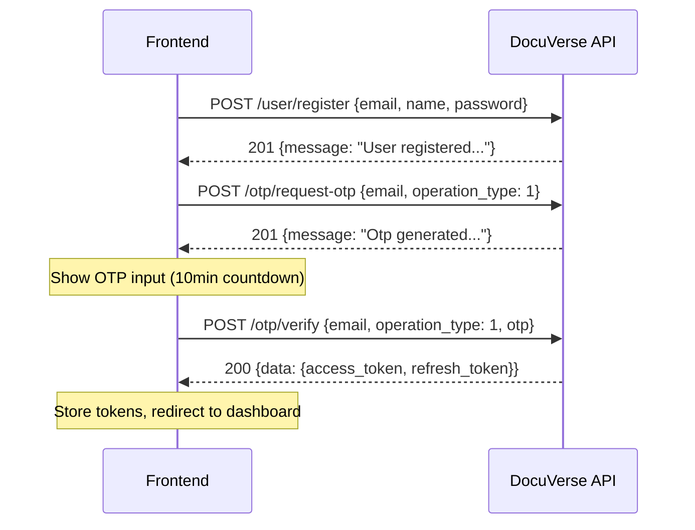
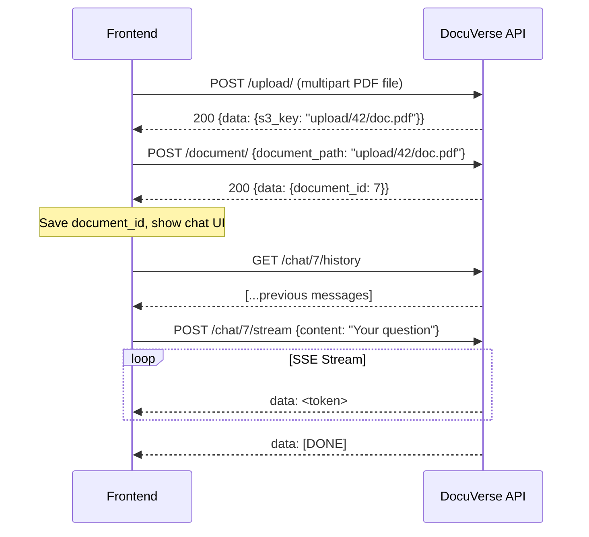

# DocuVerse — API Documentation

> For Frontend Developers building the DocuVerse web interface.

---

## Table of Contents

1. [Overview](#overview)
2. [Base URL & Environment](#base-url--environment)
3. [Authentication Strategy](#authentication-strategy)
4. [Standard Response Format](#standard-response-format)
5. [Error Handling](#error-handling)
6. [API Reference](#api-reference)
   - [User](#user-endpoints)
   - [OTP](#otp-endpoints)
   - [File Upload](#file-upload-endpoints)
   - [Document](#document-endpoints)
   - [Chat](#chat-endpoints)
7. [User Registration Flow (Full)](#user-registration-flow-full)
8. [Document Q&A Flow (Full)](#document-qa-flow-full)
9. [Frontend Integration Advisories](#frontend-integration-advisories)

---

## Overview

DocuVerse is a **RAG (Retrieval-Augmented Generation)** document Q&A backend built with **FastAPI**. It allows users to:
- Register and authenticate via email + OTP
- Upload PDF documents (stored in S3)
- Chat with their documents using an LLM in a streaming fashion

---

## Base URL & Environment

| Environment | Base URL |
|-------------|----------|
| Local Dev   | `http://localhost:8000` |

All endpoints are prefixed appropriately (see each section). The app runs on port `8000` by default using Uvicorn.

---

## Authentication Strategy

Protected endpoints use **Bearer JWT tokens** passed in the `Authorization` header.

```
Authorization: Bearer <access_token>
```

### Token Types

| Token | Purpose | Lifespan |
|---|---|---|
| `access_token` | Authenticate API requests | Short-lived (minutes) |
| `refresh_token` | Obtain a new access token | Long-lived (days) |

### How tokens are obtained
1. **Registration flow** → After OTP verification (`POST /otp/verify`), tokens are returned.
2. **Login** → `POST /user/login` returns both tokens.
3. **Refresh** → `POST /user/refresh` with the `refresh_token` as the Bearer token returns a new pair.

> **Advisory:** Store `access_token` in memory (React state / Zustand) and `refresh_token` in an `HttpOnly` cookie or secure storage. Never store `access_token` in `localStorage`.

---

## Standard Response Format

All endpoints (except the chat streaming endpoint) return a JSON envelope:

```json
{
  "data": <object | null>,
  "message": "Human-readable message"
}
```

| Field | Type | Description |
|---|---|---|
| `data` | `any \| null` | The actual payload (varies per endpoint) |
| `message` | `string` | Status message for feedback |

---

## Error Handling

All errors follow a consistent JSON structure:

```json
{
  "success": false,
  "error_code": "ERROR_CODE_CONSTANT",
  "detail": "Human-readable description"
}
```

### Complete Error Code Reference

| `error_code` | HTTP Status | Description |
|---|---|---|
| `USER_NOT_FOUND` | 404 | User with given email/ID does not exist |
| `USER_ALREADY_EXISTS` | 400 | Registration attempted with an existing active email |
| `INVALID_CREDENTIALS` | 401 | Wrong email or password on login |
| `USER_NOT_ACTIVE` | 403 | User exists but has not completed OTP verification |
| `UNAUTHORIZED` | 401 | Missing, invalid, or expired JWT token |
| `INVALID_OTP` | 400 | OTP is wrong or has expired (valid for 10 minutes) |
| `OTP_EXPIRED` | 400 | OTP explicitly expired |
| `OTP_NOT_FOUND` | 404 | No active OTP found for this user |
| `INVALID_REQUEST` | 400 | Unsupported `operation_type` in OTP request |
| `INVALID_FILE_TYPE` | 400 | Uploaded document is not a PDF |
| `FILE_TYPE_NOT_ALLOWED` | 400 | Uploaded file type is not permitted |
| `FILE_SIZE_EXCEEDED` | 400 | File exceeds 5 MB limit |
| `FILE_UPLOAD_FAILED` | 500 | S3 upload failure |
| `FILE_NOT_FOUND` | 404 | Requested S3 file does not exist |
| `MAX_DOCUMENT_UPLOAD_REACHED` | 400 | User has reached their document upload quota |
| `CHAT_LOCKED` | 409 | Another device is currently using this chat (distributed lock) |
| `INTERNAL_SERVER_ERROR` | 500 | Unexpected server error |

> **Advisory:** Always check `error_code` (not HTTP status alone) for precise error dispatching in the UI (e.g., distinguishing `USER_NOT_ACTIVE` from `USER_NOT_FOUND` both impact the registration UX differently).

---

## API Reference

---

### User Endpoints

Base prefix: `/user`

---

#### `GET /user/`

> Get a user by email. *(Mostly for admin/debug — typically not needed in the standard user-facing FE flow.)*

**Auth required:** No

**Query Parameters:**

| Param | Type | Required | Description |
|---|---|---|---|
| `email` | `string (email)` | ✅ | User's email address |

**Success Response `200`:**

```json
{
  "id": 1,
  "name": "John Doe",
  "email": "john@example.com",
  "user_type": "USER",
  "status_id": 1
}
```

**Possible Errors:** `USER_NOT_ACTIVE (403)`

---

#### `POST /user/register`

> Register a new user. The user is created in an **INACTIVE** state and must complete OTP verification to activate.

**Auth required:** No

**Request Body:**

```json
{
  "email": "john@example.com",
  "name": "John Doe",
  "password": "securePassword123"
}
```

| Field | Type | Required | Notes |
|---|---|---|---|
| `email` | `string (email)` | ✅ | Must be a valid email |
| `name` | `string` | ✅ | Display name |
| `password` | `string` | ✅ | Plain-text; hashed server-side |

**Success Response `201`:**

```json
{
  "data": null,
  "message": "User registered successfully. Verify otp to activate the user"
}
```

**Possible Errors:** `USER_ALREADY_EXISTS (400)`

> **Advisory:** After a successful registration, immediately redirect the user to the OTP request screen (call `POST /otp/request-otp` to send them an OTP).

---

#### `POST /user/login`

> Authenticate an existing active user and receive JWT tokens.

**Auth required:** No

**Request Body:**

```json
{
  "email": "john@example.com",
  "password": "securePassword123"
}
```

**Success Response `200`:**

```json
{
  "data": {
    "access_token": "<jwt>",
    "refresh_token": "<jwt>"
  },
  "message": "User verified successfully"
}
```

**Possible Errors:** `INVALID_CREDENTIALS (401)`, `USER_NOT_ACTIVE (403)`

> **Advisory:** On `USER_NOT_ACTIVE`, prompt the user to complete OTP verification rather than showing a generic error.

---

#### `GET /user/profile`

> Get the authenticated user's profile.

**Auth required:** ✅ Access Token

**Success Response `200`:**

```json
{
  "data": {
    "id": 1,
    "name": "John Doe",
    "email": "john@example.com",
    "user_type": "USER",
    "status_id": 1
  },
  "message": "User retrieved successfully."
}
```

**Possible Errors:** `UNAUTHORIZED (401)`, `USER_NOT_FOUND (404)`

---

#### `POST /user/refresh`

> Exchange a valid refresh token for a new access/refresh token pair.

**Auth required:** ✅ **Refresh Token** (pass as Bearer token instead of access token)

**Request Body:** *(none)*

**Success Response `200`:**

```json
{
  "data": {
    "access_token": "<new_jwt>",
    "refresh_token": "<new_jwt>"
  },
  "message": "Tokes refreshed successfully"
}
```

**Possible Errors:** `UNAUTHORIZED (401)`, `USER_NOT_FOUND (404)`

> **Advisory:** Implement an Axios/Fetch interceptor that catches `401 UNAUTHORIZED` on any protected request, calls `/user/refresh`, updates stored tokens, and retries the original request transparently.

---

### OTP Endpoints

Base prefix: `/otp`

---

#### `POST /otp/request-otp`

> Generate and dispatch an OTP for the specified operation. **Currently only `REGISTRATION` (value `1`) is supported.**

**Auth required:** No

**Request Body:**

```json
{
  "email": "john@example.com",
  "operation_type": 1
}
```

| Field | Type | Required | Notes |
|---|---|---|---|
| `email` | `string (email)` | ✅ | Must belong to an **INACTIVE** registered user |
| `operation_type` | `integer` | ✅ | `1` = REGISTRATION |

**Success Response `201`:**

```json
{
  "data": null,
  "message": "Otp generated successfully."
}
```

**Possible Errors:** `USER_NOT_FOUND (404)` (if user is not registered or already active), `INVALID_REQUEST (400)` (unsupported operation_type)

> **Advisory:** The OTP is valid for **10 minutes**. Display a countdown timer in the UI. Provide a "Resend OTP" button that re-calls this endpoint; the server automatically invalidates the previous OTP.

---

#### `POST /otp/verify`

> Verify the OTP submitted by the user. On success, activates the user account and returns JWT tokens.

**Auth required:** No

**Request Body:**

```json
{
  "email": "john@example.com",
  "operation_type": 1,
  "otp": "482910"
}
```

| Field | Type | Required | Notes |
|---|---|---|---|
| `email` | `string (email)` | ✅ | |
| `operation_type` | `integer` | ✅ | `1` = REGISTRATION |
| `otp` | `string` | ✅ | 6-digit OTP as a string |

**Success Response `200`:**

```json
{
  "data": {
    "access_token": "<jwt>",
    "refresh_token": "<jwt>"
  },
  "message": "User verified successfully"
}
```

**Possible Errors:** `USER_NOT_FOUND (404)`, `INVALID_OTP (400)`

> **Note:** On `INVALID_OTP`, the error covers both wrong code AND expiry — inform the user the OTP may have expired and offer a resend option.

---

### File Upload Endpoints

Base prefix: `/upload`

These endpoints handle raw file management on S3. They are the **prerequisite** before calling the Document ingestion endpoint.

---

#### `POST /upload/`

> Upload a file to S3. Returns the `s3_key` that is later passed to the Document endpoint.

**Auth required:** ✅ Access Token

**Request Body:** `multipart/form-data`

| Field | Type | Required | Notes |
|---|---|---|---|
| `file` | `File` | ✅ | The file to upload |
| `folder` | `string` | ❌ | S3 folder prefix. Defaults to `"upload"`. The actual S3 path will be `{folder}/{user_id}/<filename>` |

**Success Response `200`:**

```json
{
  "data": {
    "s3_key": "upload/42/my_document.pdf"
  },
  "message": "File uploaded successfully"
}
```

**Possible Errors:** `FILE_TYPE_NOT_ALLOWED (400)`, `FILE_SIZE_EXCEEDED (400)`, `FILE_UPLOAD_FAILED (500)`, `UNAUTHORIZED (401)`

> **Advisory:**
> - Max file size is **5 MB**.
> - Only **PDF** files are accepted for document ingestion (enforced at the `/document/` endpoint).
> - Save the returned `s3_key` in state — it is required for the next step (document registration).
> - Show a progress bar for upload UX.

---

#### `GET /upload/presigned-url`

> Get a temporary pre-signed S3 URL to directly access/view a file (e.g., to display a PDF in the browser).

**Auth required:** ✅ Access Token

**Query Parameters:**

| Param | Type | Required | Description |
|---|---|---|---|
| `s3_key` | `string` | ✅ | The S3 key returned from the upload endpoint |

**Success Response `200`:**

```json
{
  "data": {
    "url": "https://s3.amazonaws.com/bucket/upload/42/my_doc.pdf?X-Amz-Signature=..."
  },
  "message": "Presigned URL generated successfully"
}
```

**Possible Errors:** `FILE_NOT_FOUND (404)`, `UNAUTHORIZED (401)`

> **Advisory:** Pre-signed URLs are **temporary** (typically expire in 15–60 min based on server config). Do not store them persistently — fetch a fresh one each time the user wants to view the file.

---

### Document Endpoints

Base prefix: `/document`

---

#### `POST /document/`

> Register an uploaded S3 PDF with the system. This triggers the full ingestion pipeline: text extraction → chunking → embedding → vector storage.

**Auth required:** ✅ Access Token

**Request Body:**

```json
{
  "document_path": "upload/42/my_document.pdf"
}
```

| Field | Type | Required | Notes |
|---|---|---|---|
| `document_path` | `string` | ✅ | The `s3_key` returned from `POST /upload/` |

> ⚠️ The document **must be a PDF**. Any other extension returns `INVALID_FILE_TYPE`.

**Success Response `200`:**

```json
{
  "data": {
    "document_id": 7
  },
  "message": "Document uploaded successfully"
}
```

**Possible Errors:** `INVALID_FILE_TYPE (400)`, `MAX_DOCUMENT_UPLOAD_REACHED (400)`, `UNAUTHORIZED (401)`, `INTERNAL_SERVER_ERROR (500)`

> **Advisory:**
> - This call can be **slow** (PDF text extraction + embedding generation). Show a loading state / processing indicator.
> - Save the returned `document_id` — it is the key for all chat operations.
> - If `MAX_DOCUMENT_UPLOAD_REACHED` is returned, inform the user they've reached their document limit and they should delete old documents (if a delete endpoint is added later).

---

### Chat Endpoints

Base prefix: `/chat`

---

#### `POST /chat/{document_id}/stream`

> Send a question and receive a **streaming SSE (Server-Sent Events)** response. The answer is generated by the LLM using RAG over the specified document.

**Auth required:** ✅ Access Token

**Path Parameters:**

| Param | Type | Required | Description |
|---|---|---|---|
| `document_id` | `integer` | ✅ | The document to chat with (from `POST /document/`) |

**Request Body:**

```json
{
  "content": "What are the key findings of this document?"
}
```

**Response:** `text/event-stream` (SSE)

The response is a stream of `data:` prefixed SSE events:

```
data: The key findings are...

data:  that the study showed...

data:  a significant improvement.

data: [DONE]

```

### SSE Event Types

| Event Content | Meaning | FE Action |
|---|---|---|
| Any regular text token | A piece of the AI answer | Append to the chat bubble |
| `[DONE]` | Stream complete | Mark message as complete, enable input |
| `[LOCKED] Another device...` | Chat is locked by another active session | Show toast/modal, disable input |
| `[ERROR] <message>` | Server-side error during generation | Show error state, allow retry |

**Possible HTTP Errors (before stream starts):** `UNAUTHORIZED (401)`, `INTERNAL_SERVER_ERROR (500)`

> **Advisory (SSE Integration):**
> ```js
> // Use EventSource or fetch() with ReadableStream
> const response = await fetch(`/chat/${documentId}/stream`, {
>   method: 'POST',
>   headers: {
>     'Content-Type': 'application/json',
>     'Authorization': `Bearer ${accessToken}`
>   },
>   body: JSON.stringify({ content: query })
> });
>
> const reader = response.body.getReader();
> const decoder = new TextDecoder();
>
> while (true) {
>   const { done, value } = await reader.read();
>   if (done) break;
>   const chunk = decoder.decode(value);
>   // Parse SSE: split by '\n', filter lines starting with 'data: '
>   const lines = chunk.split('\n');
>   for (const line of lines) {
>     if (line.startsWith('data: ')) {
>       const token = line.slice(6);
>       if (token === '[DONE]') { /* finalize */ }
>       else if (token.startsWith('[ERROR]')) { /* handle error */ }
>       else if (token.startsWith('[LOCKED]')) { /* show lock warning */ }
>       else { appendToMessage(token); }
>     }
>   }
> }
> ```
> **Important:** The native `EventSource` API does **not** support `POST` requests or custom headers. Use `fetch()` with a `ReadableStream` as shown above, or a library like [`@microsoft/fetch-event-source`](https://github.com/Azure/fetch-event-source).

> **Chat Lock:** The backend uses a distributed Redis lock per `document_id`. Only one active chat session per document is allowed at a time. If `[LOCKED]` is received, poll or retry with a delay.

---

#### `GET /chat/{document_id}/history`

> Retrieve the last N Q&A message pairs for a given document.

**Auth required:** ✅ Access Token

**Path Parameters:**

| Param | Type | Required | Description |
|---|---|---|---|
| `document_id` | `integer` | ✅ | The document whose history to fetch |

**Query Parameters:**

| Param | Type | Required | Default | Description |
|---|---|---|---|---|
| `n` | `integer` | ❌ | `10` | Number of Q&A pairs to retrieve |

**Success Response `200`:**

```json
[
  {
    "id": 101,
    "role": "USER",
    "content": "What is the main topic of this document?"
  },
  {
    "id": 102,
    "role": "AI",
    "content": "The document discusses the impact of..."
  }
]
```

**Note:** History is returned in **chronological order** (oldest first).

**Possible Errors:** `UNAUTHORIZED (401)`

> **Advisory:** Call this endpoint when a user opens a document chat to restore context. Render `USER` messages on the right and `AI` messages on the left in a standard chat bubble layout.

---

## User Registration Flow (Full)



---

## Document Q&A Flow (Full)



---

## Frontend Integration Advisories

### General

| Topic | Advisory |
|---|---|
| **Base URL** | Centralise the base URL in a single config/env variable (`VITE_API_BASE_URL`). Never hardcode `localhost:8000` in components. |
| **Content-Type** | All JSON endpoints expect `Content-Type: application/json`. The file upload endpoint uses `multipart/form-data` (set automatically by `FormData`). |
| **CORS** | The backend must be configured for CORS to allow your frontend origin. Coordinate with backend team if running on different domains/ports. |
| **HTTP Client** | Use `axios` (with interceptors) or `fetch`. Recommend `axios` for simpler interceptor-based token refresh. |

### Auth & Token Management

| Topic | Advisory |
|---|---|
| **Token Storage** | Store `access_token` in memory only. Store `refresh_token` in an `HttpOnly` cookie. |
| **Auto Refresh** | Implement a response interceptor: on `401 UNAUTHORIZED` (with `error_code: "UNAUTHORIZED"`), call `/user/refresh`, update the token, and retry. |
| **Logout** | On logout, clear both tokens from memory/cookies. There is no server-side logout endpoint, so rely on token expiry. |

### SSE / Streaming Chat

| Topic | Advisory |
|---|---|
| **EventSource vs fetch** | Do NOT use the native `EventSource` API — it doesn't support `POST` with custom headers. Use `fetch` + `ReadableStream`. |
| **Disabled input during stream** | Disable the chat input and send button while a stream is in progress to prevent concurrent requests. |
| **Chat lock** | If a `[LOCKED]` SSE event is received, inform the user and optionally enable a "Retry" button after a few seconds. |
| **Error tokens** | If `[ERROR]` is received mid-stream, display the partial response as errored and show a retry option. |

### File Upload

| Topic | Advisory |
|---|---|
| **Two-step upload** | Always call `POST /upload/` first, then `POST /document/`. Do not call `/document/` with a URL — only with the `s3_key`. |
| **File validation** | Validate file type (`.pdf`) and size (< 5 MB) **client-side** before uploading to provide instant feedback. |
| **Processing time** | Document ingestion (embedding) can take several seconds. Show a spinner/progress indicator and disable re-submission. |
| **Document quota** | If `MAX_DOCUMENT_UPLOAD_REACHED` is returned, surface a clear message telling the user their quota is full. |

### UX Patterns

| Screen | Recommended Flow |
|---|---|
| **Registration** | Register → Auto-call request-OTP → OTP input screen with 10m countdown + Resend button → On verify success → Redirect to dashboard |
| **Login** | Login form → On `USER_NOT_ACTIVE` → Redirect to OTP verification flow with email pre-filled |
| **Dashboard** | List user's documents → Click document → Load chat history → Chat interface |
| **Chat** | Load history on mount → Streaming input with token-by-token rendering → Disabled input during stream |

---

*Generated for DocuVerse Backend — FastAPI / Python*
